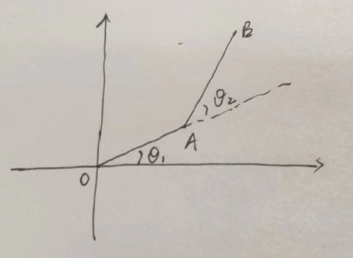
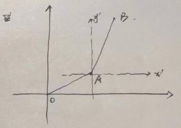
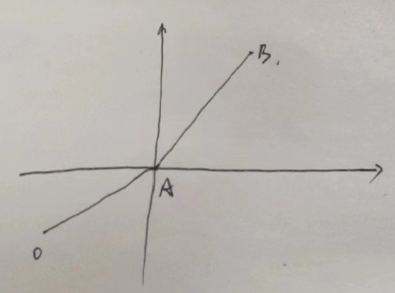

# 利用旋转来计算相对速度

$$
\begin{aligned}
    \vec{V_B} &= \vec{V_A} + \vec{V_{BA}} \\
    &= l_{OA} \dot{\theta_1} + l_{AB} (\dot{\theta_1} + \dot{\theta_2})\\
\end{aligned}
$$

---

有些让人误导的是, 相对速度$\vec{V_{BA}}$, 却用绝对角速度$\dot{\theta_1} + \dot{\theta_2}$来计算, 而不是相对角速度$\dot{\theta_2}$.

相当于坐标系如图

---

为什么是用绝对角速度来计算相对速度呢?

用 A 作为原点, 如果按照用相对速度的理解, 则 AB 的角速度会与 OA 相关, 而事实上 B 相对 A 的角速度就是相对 X 轴的角速度

所以, B 相对 A 的速度 = 杆长 x 绝对角速度
